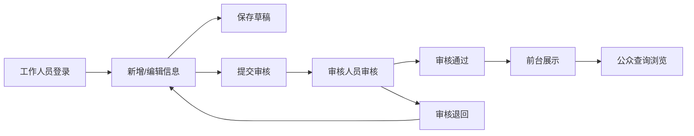

## 1. 产品概述

政务公开信息发布系统，用于政府部门工作人员发布和管理公开信息，审核人员进行内容审核，前台向公众展示已发布的公开信息。系统实现信息发布、审核、查询全流程管理，提升政务公开透明度和工作效率。

## 2. 核心功能

### 2.1 用户角色

| 角色 | 登录方式 | 核心权限 |
|------|----------|----------|
| 工作人员 | 账号密码登录 | 新增、编辑、删除信息，设置草稿/待审核状态，查看自己发布的信息 |
| 审核人员 | 账号密码登录 | 查看待审核信息，审核通过或退回，查看已审核信息 |
| 公众用户 | 无需登录 | 浏览已发布信息，按类别/关键词/日期筛选查询，查看详情 |

### 2.2 功能模块

1. **前台首页**：信息列表、分类筛选、搜索框、日期筛选、分页
2. **信息详情页**：标题、发布科室、发布日期、正文内容、附件下载
3. **后台登录页**：账号密码登录、角色选择
4. **信息管理列表**：列表展示、状态筛选、搜索、新增/编辑/删除操作
5. **信息编辑页**：表单填写（标题、类别、科室、日期、正文、附件）、状态设置
6. **审核管理列表**：待审核列表、已审核列表、审核操作（通过/退回）

### 2.3 页面详情

| 页面名称 | 模块名称 | 功能描述 |
|----------|----------|----------|
| 前台首页 | 顶部导航 | 系统名称、搜索框、分类导航 |
| 前台首页 | 信息列表 | 卡片式列表，展示标题、发布日期、科室、类别标签 |
| 前台首页 | 筛选区 | 类别下拉、日期范围选择、关键词搜索 |
| 信息详情页 | 详情内容 | 标题、元信息、正文、附件链接 |
| 后台登录页 | 登录表单 | 账号、密码、角色选择、登录按钮 |
| 信息管理页 | 列表区 | 表格展示、状态标签、操作列 |
| 信息管理页 | 搜索筛选 | 状态筛选、关键词搜索、类别筛选 |
| 信息编辑页 | 表单区 | 标题输入、类别选择、科室选择、日期选择、富文本正文、附件链接 |
| 信息编辑页 | 操作区 | 保存草稿、提交审核按钮 |
| 审核管理页 | 待审核列表 | 表格展示、查看详情、通过/退回操作 |
| 审核管理页 | 已审核列表 | 展示历史审核记录、审核结果 |

## 3. 核心流程

### 信息发布审核流程

工作人员登录后台 → 新增信息并填写内容 → 保存草稿或提交审核 → 审核人员收到待审核信息 → 审核通过（信息变为已发布）或退回（信息退回编辑）→ 已发布信息在前台展示 → 公众用户可浏览查询

## 4. 用户界面设计

### 4.1 设计风格

- **主色调**：政务蓝（#1e40af），体现正式、专业、可信的政府形象
- **辅助色**：浅灰（#f3f4f6）背景，深灰（#374151）文字
- **状态色**：草稿（灰色）、待审核（橙色）、已发布（绿色）、已退回（红色）
- **按钮风格**：圆角矩形，实心主按钮，空心次按钮
- **字体**：系统字体，清晰易读，正文14px，标题18-24px
- **布局风格**：卡片式布局，清晰的信息层级，表格化数据展示
- **图标风格**：简洁线性图标，统一风格

### 4.2 页面设计概述

| 页面名称 | 模块名称 | UI元素 |
|----------|----------|--------|
| 前台首页 | 顶部导航 | 蓝色导航栏，系统名称居左，搜索框居右 |
| 前台首页 | 筛选区 | 白色卡片，下拉选择器+日期选择器+搜索按钮 |
| 前台首页 | 信息列表 | 白色卡片列表，左侧标题+摘要，右侧日期+类别标签 |
| 信息详情页 | 详情内容 | 大标题，元信息行，正文区域，附件区块 |
| 后台登录页 | 登录表单 | 居中卡片，简洁表单，蓝色主按钮 |
| 信息管理页 | 顶部操作栏 | 新增按钮+搜索框+状态筛选下拉 |
| 信息管理页 | 数据表格 | 标准表格，状态标签，操作按钮组 |
| 信息编辑页 | 表单布局 | 两列布局，标签+输入框，富文本编辑器 |
| 审核管理页 | Tab切换 | 待审核/已审核Tab切换，表格展示 |

### 4.3 响应式

- 桌面端优先设计，适配1280px及以上屏幕
- 平板端自适应布局，表格可横向滚动
- 移动端优化列表展示，简化筛选区域
- 触控友好，按钮最小点击区域44px

### 4.4 交互动效

- 页面切换淡入淡出过渡
- 按钮悬停状态变化
- 状态标签颜色区分明显
- 表格行悬停高亮
- 模态框弹出缓动效果
