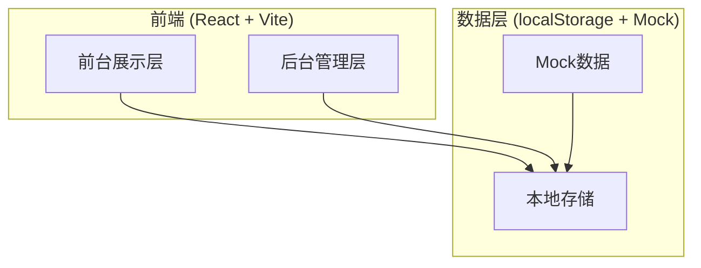
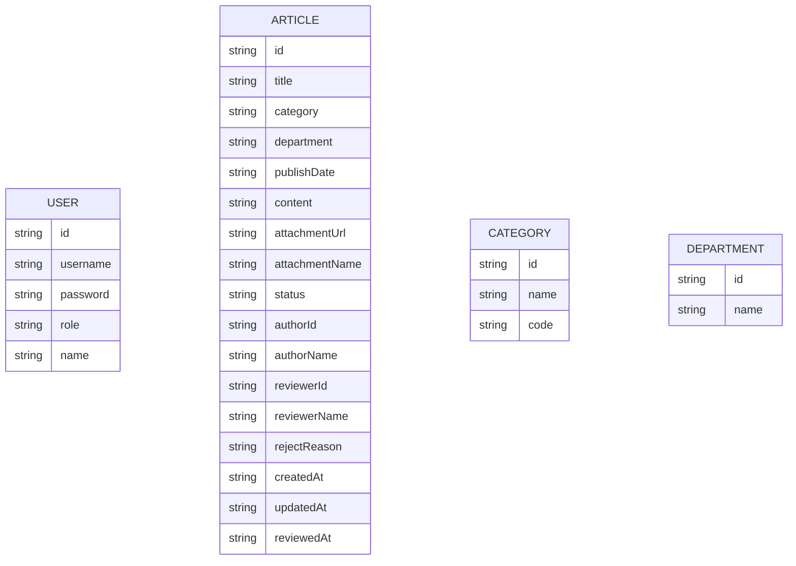

## 1. 架构设计



## 2. 技术描述

- **前端框架**：React@18 + React Router@6
- **构建工具**：Vite@5
- **样式方案**：Tailwind CSS@3
- **UI 组件**：Lucide React 图标库
- **富文本编辑器**：简易富文本（contentEditable）
- **状态管理**：React Context + useReducer
- **数据持久化**：localStorage
- **数据方案**：Mock 数据 + 本地存储，无需后端服务

## 3. 路由定义

| 路由路径 | 页面名称 | 说明 |
|----------|----------|------|
| / | 前台首页 | 公开信息列表，支持筛选搜索 |
| /detail/:id | 信息详情页 | 展示单条公开信息详情 |
| /admin/login | 后台登录页 | 工作人员/审核人员登录 |
| /admin/articles | 信息管理列表 | 工作人员管理信息列表 |
| /admin/articles/new | 新增信息页 | 工作人员新增公开信息 |
| /admin/articles/:id/edit | 编辑信息页 | 工作人员编辑已有信息 |
| /admin/review | 审核管理页 | 审核人员审核待发布信息 |

## 4. 数据模型

### 4.1 数据模型定义



### 4.2 数据结构说明

#### 信息状态枚举
- `draft` - 草稿
- `pending` - 待审核
- `published` - 已发布
- `rejected` - 已退回

#### 用户角色枚举
- `editor` - 工作人员（编辑）
- `reviewer` - 审核人员

## 5. 核心模块设计

### 5.1 数据存储模块
- 使用 localStorage 持久化数据
- 统一的数据存取接口
- 初始 Mock 数据注入

### 5.2 认证模块
- 登录状态管理
- 角色权限控制
- 路由守卫

### 5.3 信息管理模块
- 信息的增删改查
- 状态流转管理
- 筛选和搜索

### 5.4 审核模块
- 待审核列表
- 审核操作（通过/退回）
- 审核记录

### 5.5 前台展示模块
- 已发布信息列表
- 多维度筛选查询
- 详情展示

## 6. 目录结构

```
src/
├── components/         # 公共组件
│   ├── Layout/        # 布局组件
│   ├── ArticleCard/   # 信息卡片
│   ├── StatusTag/     # 状态标签
│   └── Pagination/    # 分页组件
├── pages/             # 页面组件
│   ├── Home/          # 前台首页
│   ├── Detail/        # 详情页
│   ├── Login/         # 登录页
│   ├── ArticleList/   # 信息管理列表
│   ├── ArticleEdit/   # 信息编辑页
│   └── ReviewList/    # 审核管理页
├── context/           # React Context
│   └── AppContext.js  # 全局状态
├── data/              # Mock 数据
│   └── mockData.js    # 初始数据
├── utils/             # 工具函数
│   ├── storage.js     # 本地存储工具
│   └── helpers.js     # 通用工具函数
├── App.jsx            # 应用入口
├── main.jsx           # 渲染入口
└── index.css          # 全局样式
```
